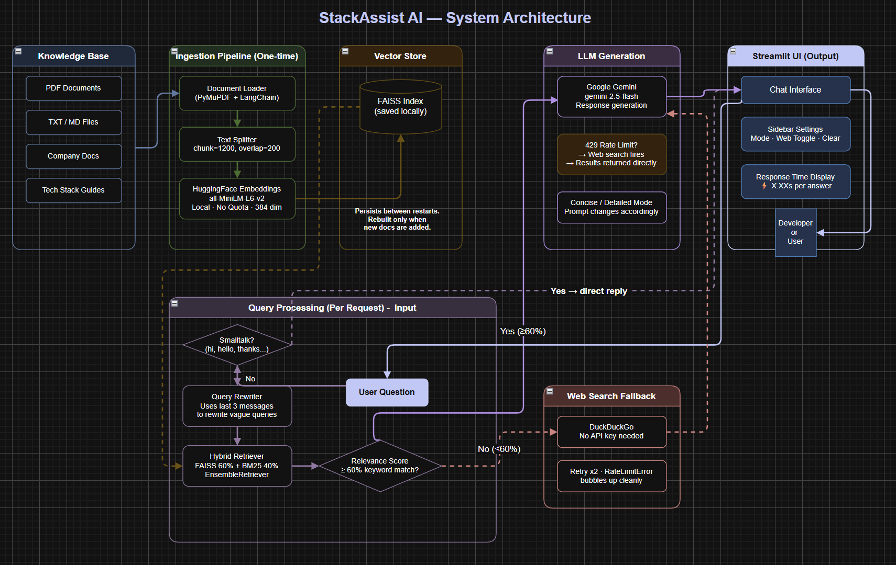

<div align="center">

# 🛠️ StackAssist AI

### An Internal Developer Knowledge Assistant

*Ask questions. Get answers. From your own company's docs.*

[](https://stackassist-ai-neostats.streamlit.app)
[](https://github.com/Giradhar744/StackAssist-AI)


</div>

---

## 🤔 What is StackAssist AI?

Imagine joining a new company. There are hundreds of internal docs, runbooks, API references, architecture guides — all scattered across different places. You spend days just trying to understand how things work.

**StackAssist AI solves this.**

It's a conversational AI assistant that any company can set up with their own documentation. Developers simply ask questions in plain language and get accurate answers pulled directly from the company's internal knowledge base — no more digging through folders, no more bothering senior developers with the same questions repeatedly.

> **The best part?** It works for any company, any tech stack. Just load your docs and it becomes an expert on everything in them.

```
Company A loads → AWS + Kafka + Django docs   → developers ask about their stack ✅
Company B loads → Azure + React + Spring docs  → developers ask about their stack ✅
Company C loads → GCP + Flutter + Rails docs   → developers ask about their stack ✅
```

---

## 🖼️ Screenshots

### System Architecture
> *Add your architecture diagram screenshot here*

```
<!-- Replace this block with your architecture image -->

```


> **How to add screenshots:**
> 1. Create an `assets/` folder in your repo root
> 2. Add your screenshots there
> 3. Replace the placeholder paths above with your actual image filenames

---

## ✨ Features

### Mandatory Features
| Feature | What it does |
|---|---|
| 🔍 **RAG Pipeline** | Loads your docs, splits them into chunks, embeds them into FAISS, retrieves the most relevant ones, and sends them to Gemini to generate an answer |
| 🌐 **Live Web Search** | When the knowledge base doesn't have a good enough answer, it automatically searches the web using DuckDuckGo — no extra API key needed |
| 📝 **Concise / Detailed Mode** | Developers pick how much detail they want — Concise gives a quick 3-5 line answer, Detailed gives step-by-step explanation |
| 🔀 **Hybrid Retrieval** | Combines FAISS semantic search (finds meaning) with BM25 keyword search (finds exact terms) for much better coverage |

### Additional Features (Beyond Scope)
| Feature | What it does |
|---|---|
| ✏️ **Query Rewriting** | If you ask a vague follow-up like "what endpoints does it have?", the app rewrites it using your last 3 messages to make it specific before searching |
| 📊 **Relevance Scoring** | Checks if retrieved docs actually match the question (60% keyword overlap threshold) — if not, web search fires automatically |
| 🛡️ **Rate Limit Fallback** | If Gemini hits its API limit (429), instead of crashing, the app returns web search results directly so developers still get an answer |
| 🧠 **Conversation Memory** | Uses chat history for context — but only in the query rewriter, not the main prompt, so responses stay fast |
| 👋 **Smalltalk Detection** | Greetings like "hi" or "thanks" are handled directly without triggering the full RAG pipeline |
| ⚠️ **Custom Error Handling** | Clean error classes (`RateLimitError`, `WebSearchError`) with retry logic — no raw Python tracebacks shown to users |

---

## 🏗️ How It Works

Here's the full journey from a developer's question to the answer:

```
Developer types a question
        │
        ▼
Is it a greeting? (hi, hello, thanks...)
        │
   Yes ─┼─► Direct friendly reply
        │
       No
        │
        ▼
Query Rewriter
(uses last 3 messages to make vague queries specific)
        │
        ▼
Hybrid Retriever
FAISS semantic search (60%) + BM25 keyword search (40%)
        │
        ▼
Relevance Check
Is the retrieved content relevant? (≥60% keyword overlap)
        │
   Yes ─┼─► Send to Gemini LLM ──► Answer to Developer ✅
        │
       No
        │
        ▼
DuckDuckGo Web Search
        │
        ▼
Send web results to Gemini LLM ──► Answer to Developer ✅
        │
   (If Gemini hits rate limit)
        │
        ▼
Return web search results directly ──► Answer to Developer ✅
```

---

## 📁 Project Structure

```
StackAssist-AI/
│
├── 📁 config/
│   └── config.py              ← All settings: API keys, paths, model names
│
├── 📁 models/
│   ├── llm.py                 ← Sets up Google Gemini for generating answers
│   └── embeddings.py          ← Sets up HuggingFace for converting text to vectors
│
├── 📁 utils/
│   ├── document_loader.py     ← Reads PDF, TXT, MD files from knowledge_base/
│   ├── text_splitter.py       ← Breaks documents into smaller chunks
│   ├── vector_store.py        ← Builds and saves the FAISS vector index
│   ├── hybrid_retrievers.py   ← Combines FAISS + BM25 into one retriever
│   ├── prompt.py              ← The brain — query rewriting, relevance check, RAG pipeline
│   └── web_search.py          ← DuckDuckGo search with retry and error handling
│
├── 📁 knowledge_base/         ← 📌 Put your company docs here
├── 📁 vector_db/              ← FAISS index lives here (auto-created on first run)
│
├── app.py                     ← Main Streamlit UI
├── requirements.txt           ← All Python dependencies
└── .gitignore
```

---

## 🚀 Getting Started

### Step 1 — Clone the repo

```bash
git clone https://github.com/Giradhar744/StackAssist-AI.git
cd StackAssist-AI
```

### Step 2 — Create a virtual environment

```bash
python -m venv venv

# Windows
venv\Scripts\activate

# Mac / Linux
source venv/bin/activate
```

### Step 3 — Install dependencies

```bash
pip install -r requirements.txt
```

> 💡 On first run, HuggingFace will automatically download the embedding model (~80MB). This only happens once and gets cached on your machine.

### Step 4 — Set up your API key

Create a `.env` file in the project root:

```env
GOOGLE_API_KEY=your_google_api_key_here
```

Get your free API key from [Google AI Studio](https://aistudio.google.com/app/apikey).

### Step 5 — Add your documents

Drop your company's documentation files (PDF, TXT, or MD) into the `knowledge_base/` folder.

### Step 6 — Run the app

```bash
streamlit run app.py
```

Open your browser at `http://localhost:8501` and start asking questions!

> ⏱️ **First run takes 1-2 minutes** to build the FAISS index. Every restart after that loads the saved index instantly.

---

## ⚙️ Configuration

All settings are in `config/config.py`. Here's what you can tweak:

| Setting | Default | What it controls |
|---|---|---|
| `GEMINI_LLM_MODEL` | `gemini-2.5-flash` | Which Gemini model generates answers |
| `CHUNK_SIZE` | `1200` | How large each document chunk is |
| `CHUNK_OVERLAP` | `200` | How much chunks overlap (helps preserve context) |
| `RETRIEVER_TOP_K` | `4` | How many chunks are retrieved per query |
| `BATCH_SIZE` | `40` | How many chunks are processed per batch |

---

## 🔑 Environment Variables

| Variable | Required | Description |
|---|---|---|
| `GOOGLE_API_KEY` | ✅ Yes | Your Google Gemini API key |

> **Never commit your `.env` file** — it's already in `.gitignore`.
>
> For Streamlit Cloud deployment, add secrets via **Settings → Secrets** in your Streamlit dashboard.

---

## 🧠 Key Technical Decisions

### Why HuggingFace instead of Gemini for embeddings?
Gemini's free tier allows only 1,000 embedding requests per day. Our knowledge base has 2,250 chunks — meaning the app would crash mid-build every single restart. HuggingFace's `all-MiniLM-L6-v2` runs entirely on your local machine with no quota, no cost, and indexes everything in under 2 minutes.

### Why hybrid retrieval (FAISS + BM25)?
Neither method alone is good enough. FAISS semantic search is great at finding conceptually similar content but misses exact keyword matches. BM25 keyword search is great at finding exact terms but misses the meaning behind a question. Combining them (60% semantic + 40% keyword) gives noticeably better results across different query types.

### Why query rewriting?
Without it, vague follow-up questions fail badly. If a developer asks "what endpoints does it have?" after a conversation about Stripe, the retriever has no idea what "it" refers to and returns random docs. The query rewriter uses the last 3 messages to turn this into "what API endpoints does Stripe have?" — a specific, searchable query. This is a tiny fast LLM call that doesn't slow down the main response.

### Why use chat history only in the rewriter, not the main prompt?
Passing the full conversation history into every prompt makes responses slower over time as the conversation grows. By using history only in the lightweight rewriting step, the main Gemini call always gets a small focused prompt and stays fast.

---

## 🐛 Challenges We Solved

| Challenge | What went wrong | How we fixed it |
|---|---|---|
| **Embedding quota** | Gemini 1,000 req/day limit, 2,250 chunks needed — crashed every restart | Switched to HuggingFace local embeddings — unlimited, no cost |
| **FAISS API change** | `from_embeddings()` expected `(text, vector)` tuples, not separate arguments | Restructured the call and replaced dummy function with proper `Embeddings` class |
| **Wrong docs retrieved** | Vague queries returned completely irrelevant docs | Added query rewriting using last 3 messages before retrieval |
| **Web search not firing** | Retriever always returned something (even wrong docs), so fallback never triggered | Replaced empty-context check with 60% keyword relevance score |
| **App crashing on rate limit** | Gemini 429 error surfaced as raw Python traceback | Added `RateLimitError` class — web search fires as fallback, user sees clean message |
| **API key failing on cloud** | `st.secrets` failed because `import streamlit` ran before Streamlit runtime was ready | Moved the import inside the function so it only runs inside Streamlit's context |

---

## 🛠️ Tech Stack

| Component | Technology | Why |
|---|---|---|
| **LLM** | Google Gemini 2.5 Flash | Fast, free tier available, great quality |
| **Embeddings** | HuggingFace all-MiniLM-L6-v2 | Local, unlimited, no quota |
| **Vector DB** | FAISS | Fast similarity search, saves locally |
| **Retrieval** | FAISS + BM25 EnsembleRetriever | Best of semantic + keyword search |
| **Framework** | LangChain | Connects all components cleanly |
| **Web Search** | DuckDuckGo | Free, no API key needed |
| **UI** | Streamlit | Simple, fast to build, easy to deploy |

---

## 🌐 Deployment

The app is deployed on Streamlit Cloud:

**🔗 Live App: [https://stackassist-ai-neostats.streamlit.app](https://stackassist-ai-neostats.streamlit.app)**

### Deploy your own instance

1. Fork this repo
2. Go to [share.streamlit.io](https://share.streamlit.io)
3. Connect your GitHub repo
4. Set main file as `app.py`
5. Go to **Settings → Secrets** and add:
   ```toml
   GOOGLE_API_KEY = "your_key_here"
   ```
6. Deploy!

---

## 📄 License

This project was built as part of the **NeoStats AI Engineer Case Study** — *The Chatbot Blueprint: Imagine, Build, Solve.*

---

<div align="center">

Built with ❤️ by **Giradhar Gopal Kumar**

</div>